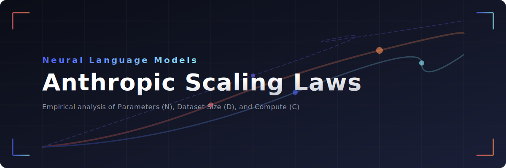

# 📈 Anthropic-Scaling-Laws

  

  
  
  
  
  

---

## 📝 Anthropic Scaling Laws for Neural Language Models

This repository provides an SEO-friendly, comprehensive resource summarizing the empirical scaling laws for transformer-based neural language models. It is based on the foundational research led by **Jared Kaplan et al.** (the core research team that subsequently co-founded Anthropic). Learn how parameters ($N$), dataset size ($D$), and compute ($C$) predictably govern artificial intelligence capability.

---

## 🔬 1. Core Power-Law Scaling

Performance improvements follow a highly predictable mathematical path when scaling single variables isolated from constraints.

*   **[📉 Cross-Entropy Loss Decreases Predictably](docs/cross-entropy-loss-predictability.md)**
    *   Test loss scales smoothly as a power-law function: $L(X) \approx (X_c / X)^{\alpha_X}$.
    *   Applies across many orders of magnitude as shown in the original [Kaplan et al. (2020)](https://arxiv.org/abs/2001.08361) paper.
    *   Does not suffer from sudden, unexpected performance plateaus under ideal conditions, though deviations are studied in [Broken Neural Scaling Laws (Caballero et al., 2022)](https://arxiv.org/abs/2210.14891).
*   **[📐 The Three Critical Scaling Axes](docs/three-critical-scaling-axes.md)**
    *   **Parameters ($N$):** Total non-embedding model weights.
    *   **Dataset Size ($D$):** Total training tokens.
    *   **Compute ($C$):** Total floating-point operations (FLOPs) where $C \approx 6ND$.
    *   The optimal balance between these axes is detailed in the Chinchilla scaling study ([Hoffmann et al., 2022](https://arxiv.org/abs/2203.15556)).
*   **[⚙️ Minimal Hyperparameter Dependence](docs/minimal-hyperparameter-dependence.md)**
    *   Architectural details have surprisingly negligible impacts on final loss.
    *   Network depth versus network width matters very little for final performance ([Kaplan et al., 2020](https://arxiv.org/abs/2001.08361)).
    *   Shape parameters (like attention head counts) do not shift trends, as validated by Pythia suite evaluations ([Biderman et al., 2023](https://arxiv.org/abs/2304.01373)).

---

## 💻 2. Compute Allocation Strategies

When given a fixed, expanded computational budget ($C$), the research dictates a precise approach to splitting resources.

*   **[⚖️ Prioritize Model Size Over Data](docs/prioritize-model-size.md)**
    *   Kaplan et al. initially recommended allocating the majority of new compute to increasing parameters ($N \propto C^{0.73}$) and scaling data slower ($D \propto C^{0.27}$).
    *   This was challenged by the Chinchilla paper ([Hoffmann et al., 2022](https://arxiv.org/abs/2203.15556)), which found equal scaling ($N \propto C^{0.5}, D \propto C^{0.5}$) is training compute-optimal.
    *   Further adapted for inference-optimal systems like LLaMA ([Touvron et al., 2023](https://arxiv.org/abs/2302.13971)) which overtrain smaller models on more data.
*   **[🛑 Early Stopping is Optimal](docs/early-stopping-optimal.md)**
    *   Train massive models on relatively modest amounts of data and stop training significantly before reaching full optimization convergence.
    *   This methodology maximizes test performance per dollar spent under Kaplan's framework ([Kaplan et al., 2020](https://arxiv.org/abs/2001.08361)).
*   **[⚡ High Sample Efficiency](docs/high-sample-efficiency.md)**
    *   Larger models learn much faster than smaller models, requiring fewer training steps to hit identical loss milestones.
    *   This sample efficiency behaves predictably across training runs as studied in [Kaplan et al. (2020)](https://arxiv.org/abs/2001.08361) and [Biderman et al. (2023)](https://arxiv.org/abs/2304.01373).

---

## ⚠️ 3. Overfitting and Constraints

The laws define explicit boundaries where training efficiency degrades due to imbalances between parameters and data.

*   **[🚨 Predictable Overfitting Thresholds](docs/predictable-overfitting-thresholds.md)**
    *   Overfitting follows a steady, predictable mathematical relationship where penalty scales as $\delta L \propto (N^{0.74}/D)$.
    *   Scaling dataset size $D$ requires a proportional parameter boost.
    *   Limits are further explored in fine-tuning settings by [Hernandez et al. (2021)](https://arxiv.org/abs/2102.01293).
*   **[📊 The Core Scaling Equation Penalty](docs/core-scaling-equation-penalty.md)**
    *   Holding dataset size constant limits max potential performance.
    *   Infinitely scaling parameters yields diminishing returns against fixed datasets, following the joint scaling law: $L(N, D) = (N_c/N)^{\alpha_N} + (D_c/D)^{\alpha_D}$.
*   **[🧹 Data Quality Constraints](docs/data-quality-constraints.md)**
    *   Repeated training data causes severe performance degradation, causing memorization and a double-descent penalty ([Kandpal et al., 2022](https://arxiv.org/abs/2205.10487)).
    *   Subsequent research shows severe model collapse when training recursively on AI-generated data ([Shumailov et al., 2023](https://arxiv.org/abs/2305.17493)) and decaying returns from multiple epochs ([Muennighoff et al., 2023](https://arxiv.org/abs/2305.16264)).

---

## 🔮 4. Key Downstream Implications

These mathematical truths directly govern the design decisions of modern frontier artificial intelligence systems.

*   **[🔮 Performance is Highly Forecastable](docs/performance-forecastable.md)**
    *   Developers can accurately predict large model performance using cheap, small-scale pilot runs.
    *   Famous real-world validation occurred with GPT-4, where final loss was predicted using 10,000x less compute ([OpenAI, 2023](https://arxiv.org/abs/2303.08774)).
*   **[💡 The Scaling Hypothesis Validation](docs/scaling-hypothesis-validation.md)**
    *   Validates the idea that bigger networks become inherently smarter. Next-token prediction optimization naturally unlocks advanced cognitive capabilities.
    *   Studies on emergent capabilities ([Wei et al., 2022](https://arxiv.org/abs/2206.07682)) and scaling critiques ([Schaeffer et al., 2023](https://arxiv.org/abs/2304.15004)) discuss how these curves map to downstream task breakthroughs.

