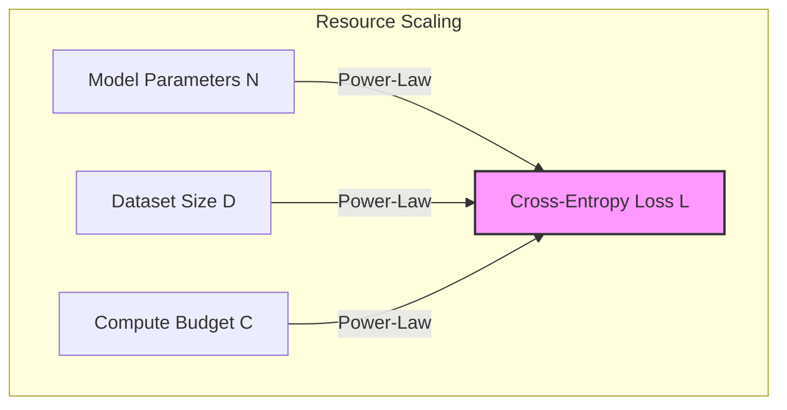

# Cross-Entropy Loss Predictability

The core discovery of neural scaling laws is that language model performance (measured by cross-entropy loss, $L$) scales predictably as a power-law when not bottlenecked by other resource constraints.

## Concept Overview
When scaling model parameters ($N$), dataset size ($D$), or training compute ($C$) independently while keeping other axes unconstrained, test loss decreases smoothly according to a power-law relation:

$$L \approx \left(\frac{X_c}{X}\right)^{\alpha_X}$$

Where:
- $X$ is the variable being scaled ($N$, $D$, or $C$).
- $X_c$ is a scaling constant.
- $\alpha_X$ is the scaling exponent.

This behavior spans over many orders of magnitude without sudden or unexpected plateaus, allowing researchers to estimate large-scale performance from small-scale experiments.

## Key Paper Citations
- **Original Foundation:**
  - [Jared Kaplan et al., 2020: "Scaling Laws for Neural Language Models"](https://arxiv.org/abs/2001.08361) — Discovered that cross-entropy loss follows a power-law across over seven orders of magnitude.
- **Modality Generalization:**
  - [Tom Henighan et al., 2020: "Scaling Laws for Autoregressive Generative Modeling"](https://arxiv.org/abs/2010.14701) — Extended these power-law dynamics to other modalities including images, video, and mathematical formulas.
- **Deviations and Corrections:**
  - [Caballero et al., 2022: "Broken Neural Scaling Laws"](https://arxiv.org/abs/2210.14891) — Analyzed scenarios where scaling laws bend or shift during training or across specific ranges.

---
[← Back to README](../README.md)
