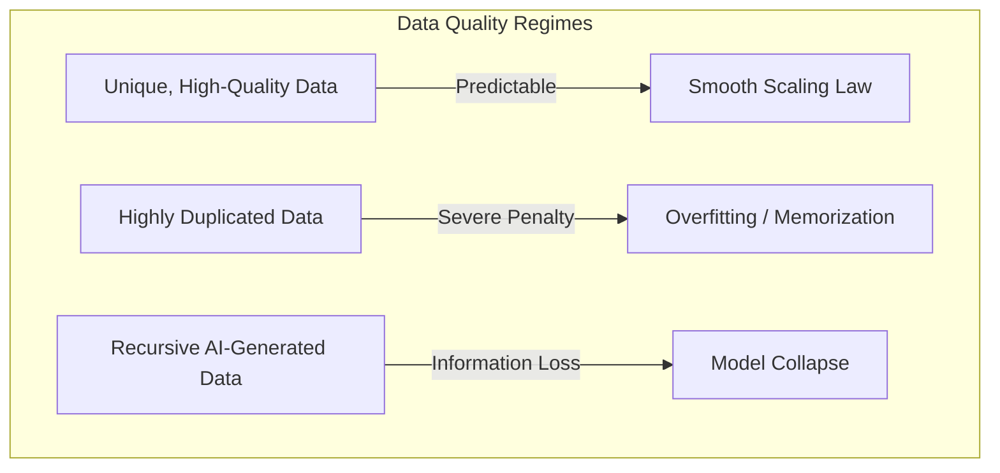

# Data Quality and Duplication Constraints

Standard scaling laws assume unique, high-quality training tokens. When training data is duplicated or contains noise, the empirical scaling laws break down, leading to rapid performance degradation.

## Concept Overview
- **Data Duplication:** Repeated training data causes models to memorize specific examples rather than generalizing. This degrades scaling efficiency and causes a double-descent penalty where validation loss worsens.
- **Model Collapse:** Training models on AI-generated data recursively leads to "model collapse," where the model forgets rare events and statistical distributions degrade over generations.
- **Epoch Scaling Limits:** Training for multiple epochs on the same dataset provides decaying returns. Research shows that after 4–15 epochs, the value of additional epochs drops to near zero.

## Key Paper Citations
- **Data Duplication:**
  - [Nikhil Kandpal et al., 2022: "Deduplicating Training Data Makes Language Models Better"](https://arxiv.org/abs/2205.10487) — Demonstrated that sequence duplication in the pretraining corpus leads to memorization and impairs scaling.
- **Model Collapse:**
  - [Ilia Shumailov et al., 2023: "The Curse of Recursion: Training on Generated Data Makes Models Forget"](https://arxiv.org/abs/2305.17493) — Showed that recursive training on synthetic data degrades scaling curves.
- **Multi-Epoch Limits:**
  - [Niklas Muennighoff et al., 2023: "Scaling Data-Constrained Language Models"](https://arxiv.org/abs/2305.16264) — Analyzed the exact mathematical penalty of multi-epoch training under constrained dataset limits.

---
[← Back to README](../README.md)
