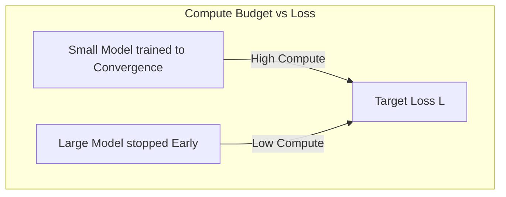

# Early Stopping is Optimal

Under the scaling laws proposed by Kaplan et al., the most compute-efficient way to train models is to use massive parameter counts and stop training long before convergence.

## Concept Overview
Rather than training a small model to full convergence (where the loss curve flattens completely), training a much larger model and stopping early achieves the same target loss with significantly less compute (FLOPs) and time. 

- **Fully Converged Small Model:** High token throughput, but inefficient learning rate per parameter.
- **Early-Stopped Large Model:** Learns much faster per step and achieves superior validation loss at lower overall FLOP expenditures.

## Key Paper Citations
- **Original Foundation:**
  - [Jared Kaplan et al., 2020: "Scaling Laws for Neural Language Models"](https://arxiv.org/abs/2001.08361) — Highlighted the mathematical efficiency of training giant models and stopping early.
- **Generative Generalization:**
  - [Tom Henighan et al., 2020: "Scaling Laws for Autoregressive Generative Modeling"](https://arxiv.org/abs/2010.14701) — Confirmed that early stopping is optimal across non-text autoregressive generative tasks.

---
[← Back to README](../README.md)
