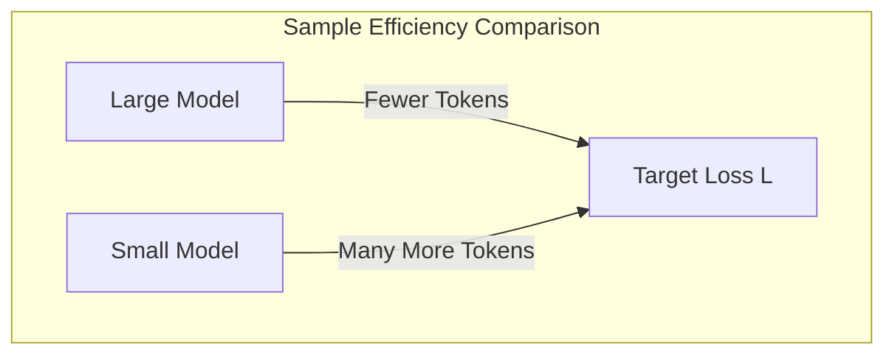

# High Sample Efficiency

Larger neural language models are significantly more sample-efficient than smaller ones, meaning they learn more from fewer tokens and require fewer optimization steps to reach the same level of loss.

## Concept Overview
If we measure the validation loss $L$ relative to the number of tokens processed, larger models outpace smaller models at every point in training.
- Large models require fewer training steps to hit identical loss milestones.
- The step efficiency scales such that the required dataset size $D$ to reach a target loss $L$ scales as $D \propto L^{-1/\alpha_D}$.

## Key Paper Citations
- **Original Foundation:**
  - [Jared Kaplan et al., 2020: "Scaling Laws for Neural Language Models"](https://arxiv.org/abs/2001.08361) — Found that larger models learn faster and require fewer steps to reach any given level of performance.
- **Suite Validation:**
  - [Stella Biderman et al., 2023: "Pythia: A Suite for Analyzing Large Language Models Across Training and Scaling"](https://arxiv.org/abs/2304.01373) — Observed high sample efficiency across Pythia models of size ranging from 70M to 12B parameters.

---
[← Back to README](../README.md)
