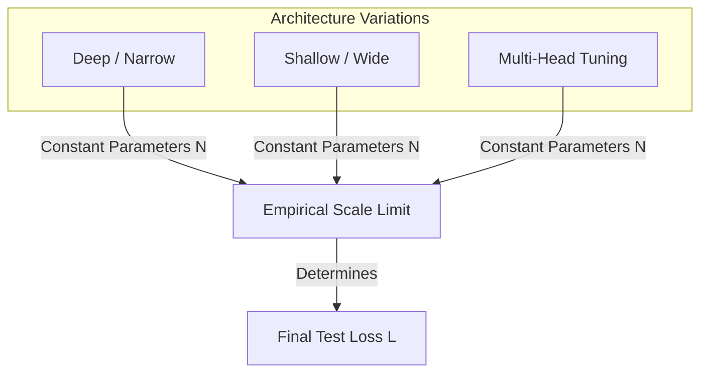

# Minimal Hyperparameter Dependence under Scale

One of the most surprising findings of early LLM scaling research is that model performance is highly insensitive to architectural details (like depth vs. width, attention heads, etc.) once scale is fixed.

## Concept Overview
Within reasonable limits, hyperparameter variations have negligible impacts on the final test loss compared to the scaling of parameters ($N$), tokens ($D$), and compute ($C$). 
- **Depth vs. Width:** A deeper, narrower model performs almost identically to a shallower, wider model of equivalent parameter count.
- **Attention Configuration:** The number of attention heads, dimension of key/value projections, and feed-forward network expansion factor have very little impact on the power-law curves.
- **Optimizers:** Standard hyperparameter tuning (learning rate schedule, batch size, etc.) affects convergence speed, but does not alter the fundamental scaling limit.

## Key Paper Citations
- **Original Foundation:**
  - [Jared Kaplan et al., 2020: "Scaling Laws for Neural Language Models"](https://arxiv.org/abs/2001.08361) — Showed that architectural hyperparameter variations within reasonable limits lead to variations in cross-entropy loss of less than $0.01$ to $0.02$ nats.
- **Suite Validation:**
  - [Stella Biderman et al., 2023: "Pythia: A Suite for Analyzing Large Language Models Across Training and Scaling"](https://arxiv.org/abs/2304.01373) — Systematically trained 8 model sizes across multiple architectures to show that training dynamics and properties scale predictably and are robust to hyperparameter details.

---
[← Back to README](../README.md)
