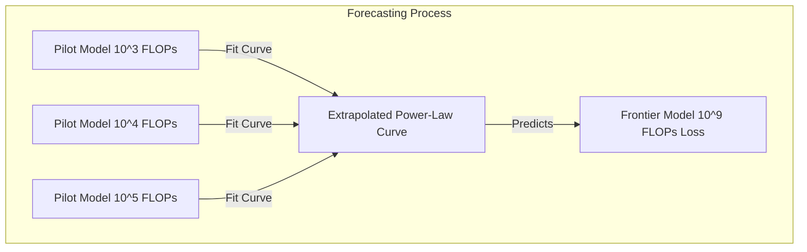

# Performance is Highly Forecastable

One of the most valuable aspects of neural scaling laws is predictability: they allow AI developers to forecast the test loss of giant models before training them.

## Concept Overview
By running small-scale pilot runs (which require several orders of magnitude less compute and budget), researchers can fit a power-law curve to the empirical loss.
This fitted curve can then be extrapolated to predict the exact final cross-entropy loss of a frontier model.
This eliminates the need for expensive trial-and-error hyperparameter sweeps on large models.

## Key Paper Citations
- **Original Foundation:**
  - [Jared Kaplan et al., 2020: "Scaling Laws for Neural Language Models"](https://arxiv.org/abs/2001.08361) — Outlined how scaling curves allow for precise resource planning.
- **Industry Case Study:**
  - [OpenAI, 2023: "GPT-4 Technical Report"](https://arxiv.org/abs/2303.08774) — Demonstrates how the final loss of GPT-4 was accurately predicted using models trained with 10,000x less compute.

---
[← Back to README](../README.md)
