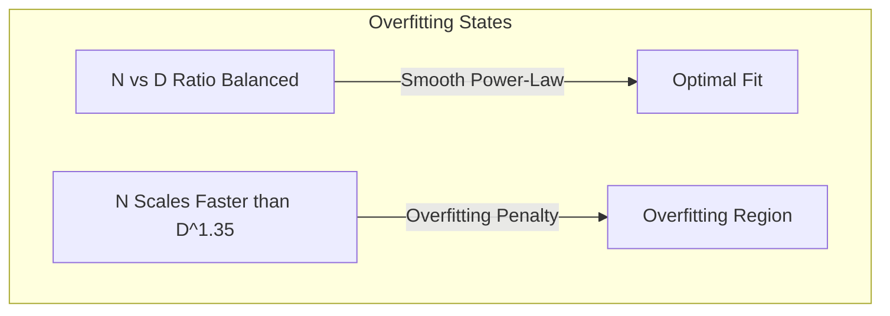

# Predictable Overfitting Thresholds

Overfitting is not random; it follows a predictable mathematical relationship governed by the ratio of parameters ($N$) to training dataset size ($D$).

## Concept Overview
The empirical boundary where overfitting starts to degrade model efficiency can be mapped accurately. 
If we scale the model size $N$ without a proportional scale in dataset size $D$, validation loss starts to deviate from the power-law prediction.
The overfitting penalty $\delta L$ follows the relation:

$$\delta L \propto \left(\frac{N^{0.74}}{D}\right)$$

This means that to prevent overfitting, dataset size must grow roughly in proportion to $N^{0.74}$.

## Key Paper Citations
- **Original Foundation:**
  - [Jared Kaplan et al., 2020: "Scaling Laws for Neural Language Models"](https://arxiv.org/abs/2001.08361) — Defined the mathematical threshold for parameter-to-data scaling to avoid overfitting.
- **Fine-Tuning Domain:**
  - [Danny Hernandez et al., 2021: "Scaling Laws for Fine-Tuning Language Models"](https://arxiv.org/abs/2102.01293) — Investigated how overfitting thresholds shift during downstream task fine-tuning vs. pretraining.

---
[← Back to README](../README.md)
