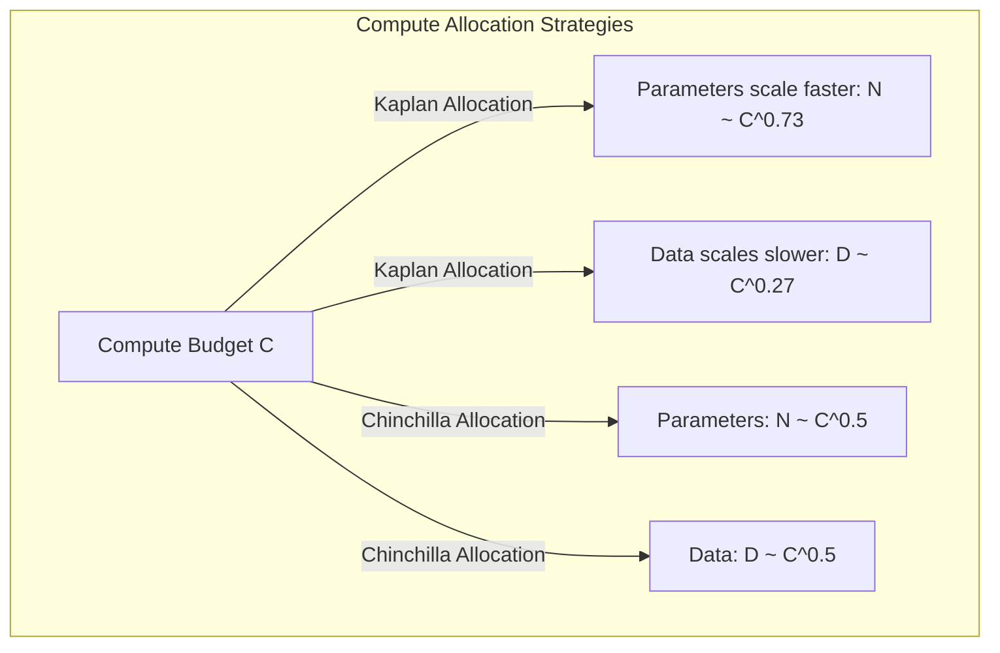

# Prioritize Model Size Over Data (Kaplan Scaling)

The early scaling laws published by Kaplan et al. suggested that as the compute budget scales, researchers should spend the vast majority of resources expanding model parameters ($N$) rather than data size ($D$).

## Concept Overview
The original Kaplan scaling allocations recommended:

$$N \propto C^{0.73}, \quad D \propto C^{0.27}$$

This means that for every $10\times$ increase in compute, model parameters should increase by approximately $5.4\times$, while the dataset size should only increase by $1.8\times$.

This allocation strategy was later refined by DeepMind's Chinchilla paper, which showed that Kaplan's models were undertrained relative to their size due to suboptimal learning rate schedules, and that parameters and tokens should scale in equal proportion ($N \propto C^{0.5}$, $D \propto C^{0.5}$).

## Key Paper Citations
- **Original Claim:**
  - [Jared Kaplan et al., 2020: "Scaling Laws for Neural Language Models"](https://arxiv.org/abs/2001.08361) — Proposed prioritizing model parameters over dataset size.
- **The Core Refutation:**
  - [Jordan Hoffmann et al., 2022: "Training Compute-Optimal Large Language Models"](https://arxiv.org/abs/2203.15556) — Introduced the Chinchilla scaling laws, proving that parameters and dataset tokens should scale 1:1.
- **Inference-Optimal Adaptation:**
  - [Hugo Touvron et al., 2023: "LLaMA: Open and Efficient Foundation Language Models"](https://arxiv.org/abs/2302.13971) — Scaled tokens far beyond both Kaplan and Chinchilla optimal thresholds to optimize models for downstream inference efficiency rather than training compute efficiency.

---
[← Back to README](../README.md)
