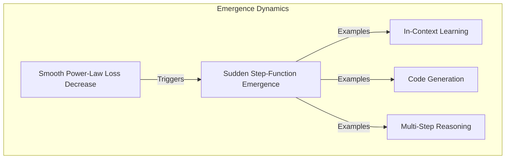

# The Scaling Hypothesis Validation

The "Scaling Hypothesis" suggests that simple architectures (like autoregressive transformers), when scaled up with sufficient compute and data, naturally unlock complex cognitive capabilities.

## Concept Overview
- **Next-Token Optimization:** The training objective is simple next-token prediction using cross-entropy loss.
- **Emergence:** As cross-entropy loss decreases smoothly, downstream task metrics often show sudden, non-linear breakthroughs (step-function emergence).
- **Generalization:** Simple scaling is sufficient to develop features like in-context learning, reasoning, translation, and code generation.

## Key Paper Citations
- **Original Foundation:**
  - [Jared Kaplan et al., 2020: "Scaling Laws for Neural Language Models"](https://arxiv.org/abs/2001.08361) — Validated the hypothesis that scale is the primary driver of performance.
- **Emergence Research:**
  - [Jason Wei et al., 2022: "Emergent Abilities of Large Language Models"](https://arxiv.org/abs/2206.07682) — Documented how downstream task accuracy transitions from zero to high performance at specific scale thresholds.
- **Critical Counter-Perspective:**
  - [Rylan Schaeffer et al., 2023: "Are Emergent Abilities of Large Language Models an Illusion?"](https://arxiv.org/abs/2304.15004) — Argued that "emergence" is often an artifact of the chosen metric (like discontinuous accuracy) rather than a discontinuous change in model capabilities, which scale smoothly.

---
[← Back to README](../README.md)
