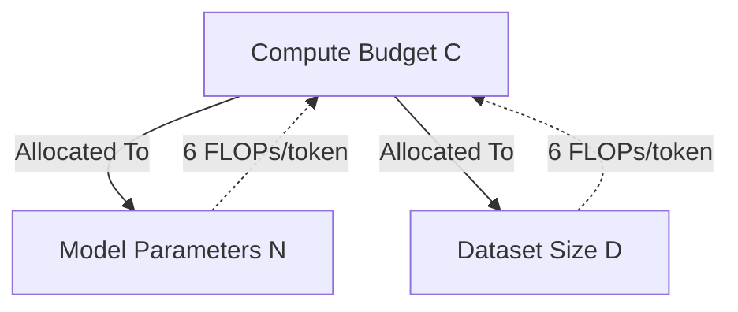

# The Three Critical Scaling Axes (N, D, C)

Large language model performance is governed by three primary resource axes: model size (parameters $N$), dataset size (training tokens $D$), and total training compute ($C$).

## Concept Overview
Compute budget $C$ (in FLOPs) is roughly related to parameters $N$ and dataset size $D$ (in tokens) by:

$$C \approx 6ND$$

This formulation accounts for:
- **Forward Pass:** $2N$ FLOPs per token.
- **Backward Pass:** $4N$ FLOPs per token (double the forward pass compute).

To optimize performance under a fixed compute budget $C$, one must balance $N$ and $D$. Different scaling regimes suggest different ratios for this allocation.

## Key Paper Citations
- **Original Foundation:**
  - [Jared Kaplan et al., 2020: "Scaling Laws for Neural Language Models"](https://arxiv.org/abs/2001.08361) — Established the $C \approx 6ND$ heuristic and suggested scaling $N$ faster than $D$ ($N \propto C^{0.73}$, $D \propto C^{0.27}$).
- **The Chinchilla Refinement:**
  - [Jordan Hoffmann et al., 2022: "Training Compute-Optimal Large Language Models"](https://arxiv.org/abs/2203.15556) — Refined the optimal compute budget allocation, demonstrating that parameters $N$ and dataset size $D$ should scale in equal proportion ($N \propto C^{0.5}$, $D \propto C^{0.5}$).

---
[← Back to README](../README.md)
